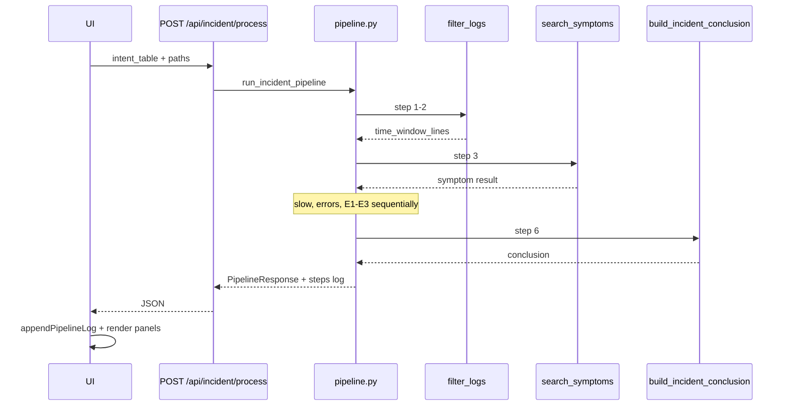

# План: автоматический пайплайн (шаги 1–6) и рефакторинг UI

**Контекст:** сейчас шаги 0–6 запускаются **отдельными кнопками**; состояние (`lastTimeWindow`, `lastSymptomData`…) живёт только в браузере.  
**Цель:** после готовой **таблицы намерений (шаг 0)** — одна кнопка **«Обработать инцидент»**; шаги **1–6 на бэкенде строго по очереди**; внизу страницы — **readonly-журнал** пройденных шагов с подписью перед каждым блоком вывода.

**Шаг 0 не входит в автопайплайн** — по-прежнему диалог + «Таблица намерений».

**Статус:** фаза 1 реализована — `POST /api/incident/process`, кнопка «Обработать инцидент», шаги **1–8** в журнале.

---

## Целевой UX

```
[Диалог + загрузка логов]
        ↓
[Шаг 0 — таблица намерений]  ← отдельно, как сейчас
        ↓
[ Обработать инцидент ]      ← одна кнопка
        ↓
Журнал пайплайна (readonly, внизу, autoscroll)
  ► Шаги 1–2: сужение логов по времени
    … краткий итог …
  ► Шаг 3: поиск по ключевым словам
    …
  …
  ► Шаг 6: итоговое заключение (LLM)
    …
        ↓
Панели результатов (как сейчас: срез, keywords, slow, errors, E1–E3, заключение)
```

---

## Текущее vs целевое

| Сейчас | Целевое |
|--------|---------|
| 6 кнопок шагов 1–6 | 1 кнопка «Обработать инцидент» |
| 7+ HTTP-вызовов с фронта | 1 оркестратор (или 1 + SSE) |
| `stepStatus` одна строка | Журнал многострочный, фиксирован внизу |
| E1–E3 только перед шагом 6 на фронте | E1–E3 внутри пайплайна на бэке, до LLM |
| Ошибка на шаге 4 — шаги 5–6 вручную не жмут | Оркестратор: stop или continue с пометкой в журнале |

---

## Архитектура бэкенда

### Новый модуль `incident_intent/pipeline.py`

Единая функция (синхронная логика, вызов из async через `to_thread`):

```text
run_incident_pipeline(req: PipelineRequest) -> PipelineResponse
```

**Порядок (строго последовательно):**

| # | ID | Вызов | Условие пропуска |
|---|-----|--------|------------------|
| 1 | `filter` | `filter_logs()` | нет `logs_path` / нет паттернов и не full_corpus |
| 2 | `symptoms` | `search_symptoms()` | пустой срез или нет keywords |
| 3 | `slow` | `find_slow_requests()` | пустой slow-срез |
| 4 | `errors` | `correlate_errors()` | пустой срез |
| 5 | `workflow_trace` | `analyze_workflow_trace()` | нет WorkflowTrace в срезе |
| 6 | `client_logs` | `analyze_client_logs()` | нет ClientLogs в срезе |
| 7 | `caseone_config` | `index_caseone_config()` | нет `caseone_path` |
| 8 | `conclusion` | `build_incident_conclusion()` | нет среза / ошибка LLM |

Между шагами передаётся **внутренний контекст** `PipelineContext` (не отдавать сырой срез 100k строк в ответе журнала — только summary).

### Модели `incident_intent/pipeline_models.py`

```python
class PipelineStepLog(BaseModel):
    step_id: str                    # filter | symptoms | ...
    title: str                      # подпись для UI
    status: Literal["ok", "skipped", "error"]
    summary_lines: list[str]        # 1–10 строк для журнала
    detail: dict | None = None      # опционально, сжато

class PipelineRequest(BaseModel):
    incident_id: str | None = None  # для путей из dialog
    intent_table: IntentTable
    logs_path: str
    caseone_path: str | None = None
    # флаги из intent_table уже внутри

class PipelineResponse(BaseModel):
    status: Literal["ok", "partial", "error"]
    steps: list[PipelineStepLog]
    filter: FilterLogsResponse | None = None
    symptom_search: SymptomSearchResponse | None = None
    slow_requests: SlowRequestsResponse | None = None
    error_correlation: CorrelateErrorsResponse | None = None
    workflow_trace: WorkflowTraceAnalysisResponse | None = None
    client_logs: ClientLogAnalysisResponse | None = None
    caseone_config: CaseoneConfigIndexResponse | None = None
    conclusion: IncidentConclusionResponse | None = None
    errors: list[str] = []
```

### API

```http
POST /api/incident/process
Content-Type: application/json

{
  "incident_id": "uuid",
  "intent_table": { ... },
  "logs_path": "...",
  "caseone_path": "..."
}
```

Ответ: `PipelineResponse` целиком (фаза 1).  
Фаза 2 (опционально): `POST /api/incident/process/stream` — **SSE** события `step_start` / `step_done` для живого журнала без ожидания всего пайплайна.

### Поведение при ошибке

- **Критическая** (нет логов, шаг 1–2 дал 0 строк и не full_corpus): `status=error`, дальше не идём; в журнале последний шаг `error`.
- **Некритическая** (шаг 3: 0 совпадений): `status` шага `ok` или `skipped`, пайплайн **продолжается**; в `summary_lines` — «совпадений нет».
- **LLM шаг 6**: ошибка Ollama → `partial`, предыдущие шаги в ответе сохранены.

### Рефакторинг существующих endpoint’ов

- **Оставить** `/api/filter-logs`, `/api/symptom-search`, … для отладки и тестов.
- Оркестратор **вызывает те же функции**, не дублирует логику.

---

## Подписи шагов для журнала (константы)

| step_id | title (строка в журнале) |
|---------|---------------------------|
| `filter` | **Шаги 1–2.** Сужение логов по времени и проверка источников |
| `symptoms` | **Шаг 3.** Поиск по ключевым словам в срезе |
| `slow` | **Шаг 4.** Долгие HTTP-запросы |
| `errors` | **Шаг 5.** Ошибки и корреляция с долгими запросами |
| `workflow_trace` | **Контекст E1.** WorkflowTrace (этапы на клиенте) |
| `client_logs` | **Контекст E2.** ClientLogs (события клиента) |
| `caseone_config` | **Контекст E3.** Индекс конфигурации caseone |
| `conclusion` | **Шаг 6.** Итоговое заключение (LLM) |

Функция `_summary_for_step(step_id, result) -> list[str]` — короткие факты без простыни JSON (например: «Срез: 1240 строк, 8 файлов», «Slow: 3 запроса > 60 с»).

---

## Рефакторинг frontend (`static/index.html`)

### Кнопки

| Убрать | Оставить |
|--------|----------|
| `filterBtn`, `symptomBtn`, `slowBtn`, `errorBtn`, `conclusionBtn` | `sendBtn`, `submitBtn` (шаг 0), **`processBtn`** «Обработать инцидент» |

`processBtn`: `disabled`, пока `intent.status !== 'complete'` или нет `logs_path` / нет среза после 0.

### Журнал пайплайна (нижняя часть страницы)

```html
<div class="pipeline-log-panel">
  <h2>Ход обработки</h2>
  <textarea id="pipelineLog" readonly></textarea>
</div>
```

CSS: `position: sticky` или фиксированная высота ~200–280px, `font-family: monospace`, `white-space: pre-wrap`, autoscroll при добавлении строк.

JS:

```javascript
function appendPipelineLog(title, lines, status) {
  const el = document.getElementById("pipelineLog");
  el.value += `\n► ${title}\n`;
  for (const line of lines) el.value += `  ${line}\n`;
  if (status === "error") el.value += "  [ОШИБКА]\n";
  el.scrollTop = el.scrollHeight;
}
```

При старте обработки: `pipelineLog.value = ""`, затем по ответу (или по SSE) — блоки по `steps[]`.

### `runIncidentPipeline()`

1. Проверки: `lastIntent.table`, `sessionPaths()`.
2. `processBtn.disabled = true`, журнал «Запуск…».
3. `POST /api/incident/process` с `intent_table`, путями, `incident_id`.
4. Для каждого `step` в ответе: `appendPipelineLog(step.title, step.summary_lines, step.status)`.
5. Разложить `response` в `lastTimeWindow`, `lastFilterSummary`, … — **те же render-функции**, что сейчас (`renderFilterResult`, …).
6. Показать панели результатов; прокрутить к заключению при успехе.
7. `processBtn.disabled = false` (или оставить disabled до смены инцидента).

Удалить: `runStep` для шагов 1–6, `STEP_LABELS` для старых кнопок, дублирующие listeners.

### Разбиение JS (фаза 2, опционально)

| Файл | Содержимое |
|------|------------|
| `static/js/dialog.js` | диалог, upload |
| `static/js/intent.js` | шаг 0, таблица |
| `static/js/pipeline.js` | process + журнал |
| `static/js/render.js` | render*Result |

На фазе 1 достаточно одного `index.html` с выделенными функциями `pipeline.*`.

---

## Схема потока данных



---

## Фазы внедрения

### Фаза 1 — оркестратор + одна кнопка (MVP)

- [ ] `pipeline_models.py`, `pipeline.py` + summaries
- [ ] `POST /api/incident/process` в `app.py`
- [ ] UI: убрать 5 кнопок, добавить `processBtn` + `#pipelineLog`
- [ ] `runIncidentPipeline()` + привязка render к полному ответу
- [ ] Тесты: `tests/test_pipeline.py` (mock LLM или skip step 6)
- [ ] README: новый flow

**Приёмка:** после шага 0 один клик → все панели заполнены, журнал содержит 8 подписанных блоков.

### Фаза 2 — живой журнал (SSE)

- [ ] `pipeline_runner` с yield событий после каждого шага
- [ ] `GET/POST .../process/stream` (EventSource)
- [ ] UI: append в журнал по мере прихода событий; индикатор «выполняется шаг N»

**Приёмка:** при долгом шаге 6 пользователь видит завершённые шаги 1–5 в журнале до ответа LLM.

### Фаза 3 — полировка UX

- [ ] Блокировка повторного запуска во время process
- [ ] Кнопка «Копировать журнал»
- [ ] Сохранение `PipelineResponse` в `DialogState` (опционально) для F5
- [ ] Авто-шаг 0 при `dialog.intent_status === complete` без второй кнопки (по желанию)

### Фаза 4 — не в этом плане

- HITL правка заключения
- Параллельный запуск шагов
- Отмена пайплайна (cancel)

---

## Карта файлов

| Файл | Действие |
|------|----------|
| `incident_intent/pipeline.py` | **новый** — оркестратор |
| `incident_intent/pipeline_models.py` | **новый** |
| `incident_intent/pipeline_summaries.py` | **новый** — текст для журнала |
| `app.py` | route `/api/incident/process` |
| `static/index.html` | кнопки, журнал, `runIncidentPipeline` |
| `static/css` или `<style>` | `.pipeline-log-panel` |
| `tests/test_pipeline.py` | **новый** |
| `README.md` | описание одной кнопки |
| `incident_intent/plan/uni_poc.md` | ссылка на план |

Существующие модули шагов **не переписывать** — только импорт из `pipeline.py`.

---

## Контракт summary_lines (примеры)

**filter:**

```
Файлов логов: 28
Строк в окне жалобы: 1240 / 158000 (срез обрезан)
Расширенное окно (4–5): 2100 строк
Форматы: iso_space, nginx
```

**symptoms:**

```
Ключевых слов: 12
Совпадений в срезе: 87
Топ файл: RequestLoggingMiddleware.log (34)
```

**slow:**

```
Порог: 60000 ms
Долгих запросов: 3
Макс: PUT /api/... 180.2 мин
```

**errors:**

```
Ошибок в окне: 15
Корреляций с slow: 2
```

**conclusion:**

```
confidence: medium
Поддержано фактами: 4 пункта
```

---

## Риски

| Риск | Митигация |
|------|-----------|
| Долгий HTTP (2–5 мин на больших логах) | SSE фаза 2; таймаут nginx/uvicorn увеличить |
| Ответ JSON огромный (срез 100k в теле) | В `PipelineResponse` **не** включать `time_window_lines` в JSON — только counts + samples |
| Дублирование render-логики | Один объект `pipelineResults` → существующие `render*` |
| Шаг 0 incomplete | `processBtn` disabled + подсказка в журнале |

---

## Чеклист «готово»

- [ ] Одна кнопка «Обработать инцидент» после шага 0
- [ ] Шаги 1–6 + E1–E3 на бэке **строго по порядку**
- [ ] Readonly-журнал внизу с подписью `►` перед каждым шагом
- [ ] Панели результатов обновляются из одного ответа
- [ ] Тесты оркестратора
- [ ] Документация обновлена

---

## Связь с другими планами

| План | Связь |
|------|--------|
| [uni_poc_E_plan.md](./uni_poc_E_plan.md) | E1–E3 встроены в пайплайн перед шагом 6 |
| [uni_poc_F_plan.md](./uni_poc_F_plan.md) | пустой срез → ошибка на шаге 1–2 + подсказка дат в журнале |
| [uni_poc.md](./uni_poc.md) | пункт UI/UX после реализации |

**Оценка:** фаза 1 ≈ **2–3 дня**; фаза 2 (SSE) ≈ **1 день**.
